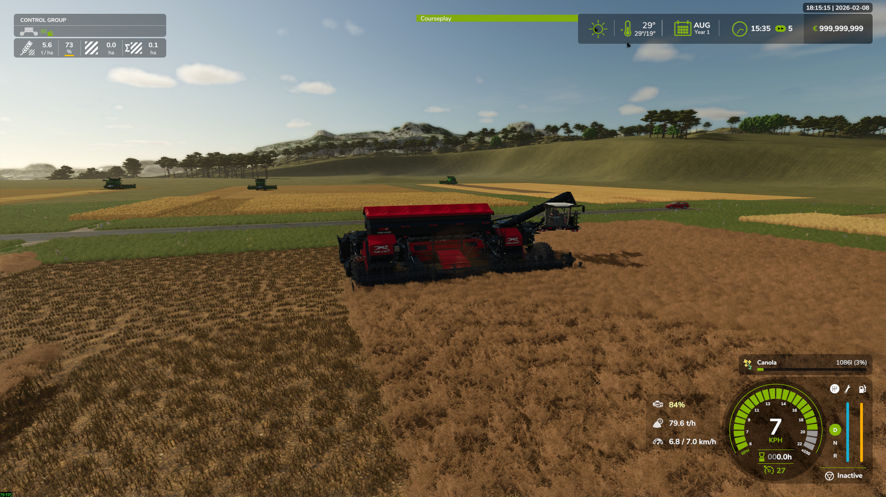
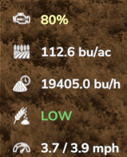
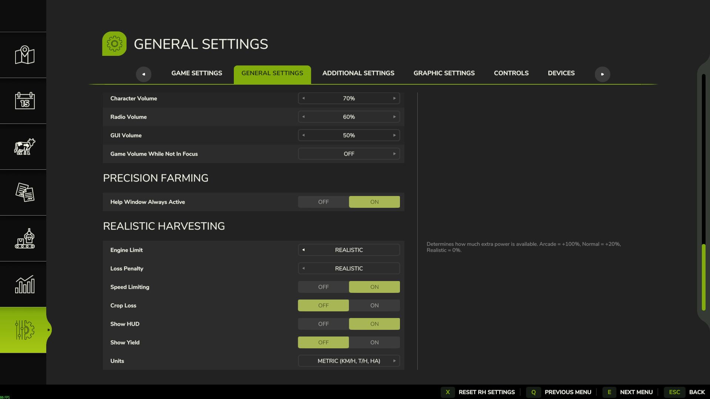
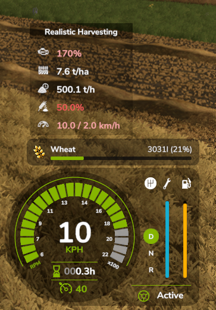
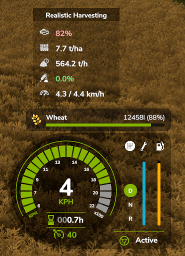
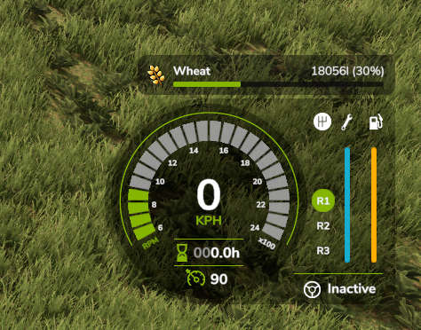

# 🌾 Realistic Harvesting - Farming Simulator 25

> **Transform your harvesting experience with realistic combine physics and authentic crop management!**

---

## 📥 Download

**Original download link:** [kingmod.net by exekx](https://www.kingmods.net/en/fs25/mods/73932/realistic-harvesting)

> ⚠️ **Please do not re-upload or modify this link - support the original creator!**

---

## 🎯 What Does This Mod Do?

**Realistic Harvesting** simulates real-world combine harvester physics in Farming Simulator 25. Instead of harvesting at full speed regardless of crop density, your combine now responds to the volume of material entering the header. Heavy crops, wide headers, and steep hills will naturally limit your speed, just like in real life.

### Key Features

*   **⚡ Smart Speed Limiting**: Automatically adjusts your harvesting speed based on engine load.
*   **📊 Advanced Yield Monitor**: Real-time display of:
    *   **Productivity**: Tons per Hour (T/h)
    *   **Engine Load**: Live percentage with color-coded feedback
    *   **Yield Data**: Accurate yield tracking with realistic fluctuation
*   **🌾 Physical Crop Loss**: Overloading now reduces actual grain collected in bunker!
    *   Losses start at 95% engine load
    *   Progressive penalty - higher overload = exponentially more loss
    *   Difficulty settings control severity (Arcade/Normal/Realistic)
*   **🚜 Vehicle Support**:
    *   **Standard Combines**: Fully supported
    *   **Forage Harvesters**: Partial support
    *   **Cotton Harvesters**: Supported
    *   **Nexat System**: Specialized support for Nexat carrier and headers
*   **🌱 Crop-Specific Physics**: Different resistance values for various crop types (e.g., Wheat vs. Corn vs. Rice).
*   **⚙️ Independent Control**: Option to start threshing and cutter separately (ideal for immersion and roleplay).
*   **⚙️ Global Settings**: Configurations are saved globally in `modSettings/`, persistent across all savegames.

---

## 🎮 Game Modes (Difficulty Settings)

You can customize the experience with **two independent difficulty settings** found in `ESC` -> `Settings` -> `Realistic Harvesting`. Mix and match to find your perfect balance!

### 🚜 Engine Power (Motor Difficulty)
Determines how much "power boost" your combine gets beyond its real-world specs.

| Mode | Boost | Capacity vs Real Life |
| :--- | :--- | :--- |
| **Arcade** | +100% | **200%** (Double capacity) |
| **Normal** | +20% | **120%** (Slightly boosted) |
| **Realistic** | +0% | **100%** (Real specs) |

### 🌾 Crop Loss (Loss Difficulty)
Determines how strictly the crop loss penalties are applied when overloading.

| Mode | Effect |
| :--- | :--- |
| **Arcade** | **50%** of standard loss penalties. |
| **Normal** | **Standard** loss penalties. |
| **Realistic** | **200%** loss penalties (Strict). |

---

## 📸 Screenshots

> **Gameplay Action**
>
> 

> **HUD Explanation (Metric)**
>
> 
>
> **HUD Explanation (Imperial)**
>
> 
>
> **HUD Explanation (Bushels)**
>
> 

> **Settings Menu**
>
> 

> **Crop Loss Comparison - High Loss Scenario**
>
> 
> *Combine showing high crop loss due to exceeding speed limits*
>
> 
> *Reduced grain amount in truck after high losses*

> **Crop Loss Comparison - Optimal Harvesting**
>
> 
> *Combine within optimal speed range, minimal losses*
>
> 
> *Maximum grain collected when following recommended speed*

---

## 📟 The HUD

A modern, non-intrusive HUD appears when you enter a harvester.

### **Features:**
*   **Moveable**: Right-Click to enable cursor, then Left-Click drag the HUD anywhere on screen.
*   **Customizable**: Toggle individual elements (Yield, Load, Speed, Loss, T/h) in settings.
*   **Real-Time Data**:
    *   **Load Bar**: Visual representation of current engine strain.
    *   **T/h Display**: Monitor your harvesting throughput efficiency.
    *   **Yield**: Live yield data (t/ha or bu/ac).
    *   **Speed**: Current vs Recommended speed to prevent clogging.
    *   **Loss**: Visual indicator of crop loss (Low/Med/High).

---

## ️ Installation

1.  Download the latest version from [kingmod.net](https://www.kingmods.net/en/fs25/mods/73932/realistic-harvesting).
2.  Place the `FS25_RealisticHarvesting.zip` file into your `mods` folder.
    *   Usually: `Documents/My Games/FarmingSimulator2025/mods/`
3.  Activate the mod in the in-game Modhub menu.

---

## 🌐 Multiplayer

**Fully Multiplayer Compatible!**
*   Each player has their own local settings and HUD preferences.
*   Speed limiting is synchronized for smooth cooperative play.

---

## 🤝 Credits & Support

**Created by:** exekx

*   **Report Bugs:** [GitHub Issues](https://github.com/exekx/FS25_RealisticHarvesting/issues)
*   **Support:** [kingmod.net](https://www.kingmods.net/en/fs25/mods/73932/realistic-harvesting)

---

**Made with ❤️ for the FS25 Community**

